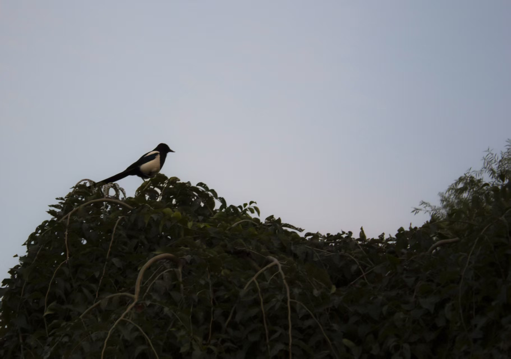
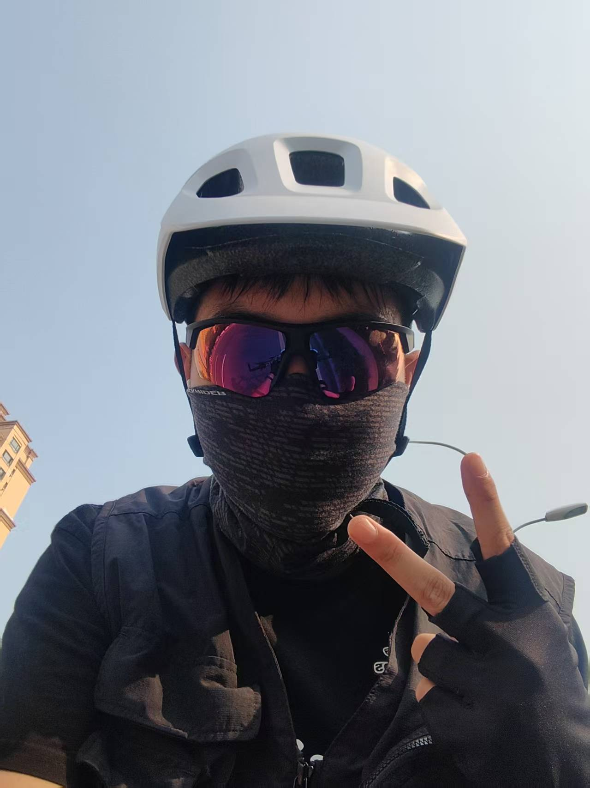

# 
👋 Welcome to My GitHub | 欢迎来到我的 GitHub

  

  
  
  

  <a href="#english">English</a> | <a href="#chinese">中文</a>

<h2 id="english">🇬🇧 English</h2>

## 🚀 About Me

- 🎓 Software Engineering student at Northeastern University, China
- 💻 Passionate about Frontend Development and App Creation
- 🔍 Research interests in Large Language Models and Federated Learning
- 🎯 Aspiring to pursue graduate studies in Computer Science
- 🏆 Award-winning participant in Mathematical Modeling Competitions
- 🔌 Experience with embedded systems development (STM32)

## 🏅 Awards & Achievements

- 🥈 Second Prize in Liaoning Provincial Mathematical Modeling Competition
- 🌟 Meritorious Winner (M Prize) in the Mathematical Contest in Modeling (MCM)
- 🏅 Provincial Prize in Liaoning Mathematics Competition

## 💡 Skills

  
  
  
  
  
  
  
  
  

## 📊 GitHub Stats

  
  

## 🏆 Projects

| Project | Description | Tech Stack |
|---------|------------|------------|
| [Titanic Survival Prediction](https://github.com/YYYanZZZ/titanic-survival-prediction) | Machine learning project that predicts survival on the Titanic. Achieved a Kaggle score of 0.79665. | Python, Pandas, Scikit-learn |
| [Project Cost Estimation Tool](https://github.com/YYYanZZZ/ProjectCost---Project-Cost-Estimation-Tool) | Software project cost estimation platform that helps estimate software development costs. | Java (Spring Boot), JavaScript, CSS |

  

## 🌟 Interests

When I'm not coding, I enjoy:
- 🚴 Cycling
- 📷 Photography
- 📚 Reading novels
- 🏀 Playing basketball
- 💪 Fitness and working out
- 🔮 Studying Chinese astrology and birth charts (BaZi)

<h2 id="chinese">🇨🇳 中文</h2>

## 🚀 关于我

- 🎓 中国东北大学软件工程专业学生
- 💻 热爱前端开发和应用程序创建
- 🔍 研究兴趣包括大型语言模型和联邦学习
- 🎯 立志攻读计算机科学研究生学位
- 🏆 在数学建模比赛中获得多项奖项
- 🔌 有嵌入式系统开发经验（STM32）

## 🏅 奖项 & 成就

- 🥈 辽宁省数学建模比赛省二等奖
- 🌟 美国大学生数学建模竞赛M奖
- 🏅 辽宁省数学竞赛省奖

## 💡 技能

  
  
  
  
  
  
  
  
  

## 📊 GitHub 统计

  
  

## 🏆 项目

| 项目 | 描述 | 技术栈 |
|---------|------------|------------|
| [泰坦尼克号生存预测](https://github.com/YYYanZZZ/titanic-survival-prediction) | 机器学习项目，预测泰坦尼克号乘客的生存情况。在Kaggle评分系统上获得0.79665的准确率。 | Python, Pandas, Scikit-learn |
| [项目成本估算工具](https://github.com/YYYanZZZ/ProjectCost---Project-Cost-Estimation-Tool) | 软件项目成本估算平台，帮助估算软件开发成本。 | Java (Spring Boot), JavaScript, CSS |

## 📸 摄影作品集

  
这里展示了我最得意的摄影作品：

  
  <!-- 用您实际照片的链接替换下面的URL -->
  
  
  

## 🚴 骑行记录

  
骑行是我编程之外最大的爱好之一：

  
  <!-- 用您实际骑行照片的链接替换下面的URL -->
  
  
  
  
<i>我最远骑行100公里，跨越各种地形。</i>

## 🌟 兴趣爱好

当我不写代码时，我喜欢:
- 🚴 骑自行车
- 📷 摄影
- 📚 阅读小说
- 🏀 打篮球
- 💪 健身锻炼
- 🔮 研究生辰八字

## 🔗 联系方式

  
  

  
  ### ⭐ 如果你喜欢我的项目，请考虑给它们点个星！⭐
  ### ⭐ If you like my projects, please consider giving them a star! ⭐
  
  随时联系我进行合作或聊天！
  Feel free to reach out if you want to collaborate or just chat!
  

 
